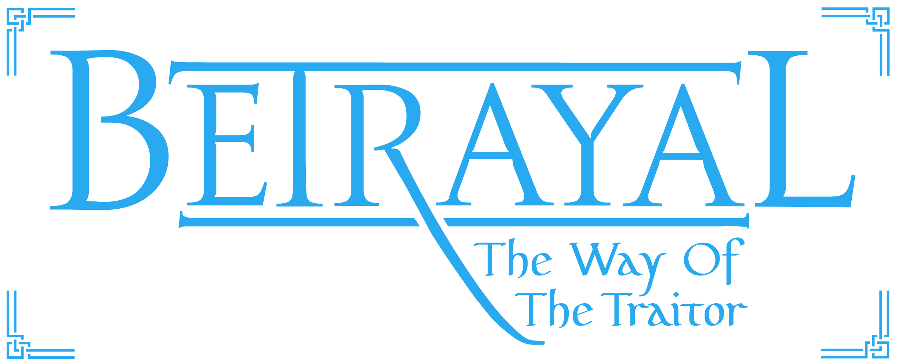

    [![Contributors][contributors-shield]][contributors-url]
    [![Forks][forks-shield]][forks-url]
    [![Stargazers][stars-shield]][stars-url]
    [![Issues][issues-shield]][issues-url]
    [![MIT License][license-shield]][license-url]
    

 

  

  <h3 align="center">VIO 202 Year Project</h3>

  

    Various projects based on my webcomic:  
    BETRAYAL - The Way Of The Traitor
  

  
Table of Contents

  <ol>
    <li>
      <a href="#about-the-project">About The Project</a>
      <ul>
        <li><a href="#built-with">Built With</a></li>
      </ul>
    </li>
    <li><a href="#license">License</a></li>
    <li><a href="#contact">Contact</a></li>
    <li><a href="#acknowledgments">Acknowledgments</a></li>
  </ol>

<!-- ABOUT THE PROJECT -->
## About The Project

During first year we were required to make a web comic for our final project. The goal of this year is to take our comics and build interactive experiences from the material.

* The first project was making an interactive trailer that takes the user on a journey and hypes them up for reading the comic
* The second project will be making an interactive infographic that gives users more info on specific topics and aspects of our comic

(<a href="#top">back to top</a>)

### Built With

Each of the 4 projects will tackle a different set of tools to achieve the end result, here are some of the tools I have used to achieve results

* [React.js](https://reactjs.org/)
* [Bootstrap](https://getbootstrap.com)
* [Adobe Animate](https://www.adobe.com/africa/products/animate.html)

(<a href="#top">back to top</a>)

<!-- ROADMAP -->
## Roadmap

- [x] Theme 1 - Interactive Trailer
- [ ] Theme 2 - Interactive Infographic
- [ ] Theme 3 - Unknown
- [ ] Theme 4 - Turning Webcomic Into Motion Comic

(<a href="#top">back to top</a>)

<!-- LICENSE -->
## License

Distributed under the MIT License. See `LICENSE.txt` for more information.

(<a href="#top">back to top</a>)

<!-- CONTACT -->
## Contact

Francois Smith - contact@francois-smith.com

(<a href="#top">back to top</a>)

<!-- ACKNOWLEDGMENTS -->
## Acknowledgments

* [Img Shields](https://shields.io)
* [Font Awesome](https://fontawesome.com)
* [React Icons](https://react-icons.github.io/react-icons/search)

(<a href="#top">back to top</a>)

<!-- MARKDOWN LINKS & IMAGES -->
[contributors-shield]: https://img.shields.io/github/contributors/francois-smith/VIO-202.svg?style=for-the-badge
[contributors-url]: https://github.com/francois-smith/VIO-202/graphs/contributors
[forks-shield]: https://img.shields.io/github/forks/francois-smith/VIO-202.svg?style=for-the-badge
[forks-url]: https://github.com/francois-smith/VIO-202/network/members
[stars-shield]: https://img.shields.io/github/stars/francois-smith/VIO-202.svg?style=for-the-badge
[stars-url]: https://github.com/francois-smith/VIO-202/stargazers
[issues-shield]: https://img.shields.io/github/issues/francois-smith/VIO-202.svg?style=for-the-badge
[issues-url]: https://github.com/francois-smith/VIO-202/issues
[license-shield]: https://img.shields.io/github/license/francois-smith/VIO-202.svg?style=for-the-badge
[license-url]: https://github.com/francois-smith/VIO-202/blob/master/LICENSE.txt
[product-screenshot]: images/screenshot.png
